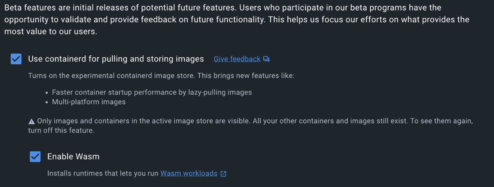

# Projekt inżynierski

Klaster Kubernetes uruchamiający aplikacje serwerowe skompilowane do formatu WebAssembly.

## Wymagania systemowe

System operacyjny: Linux, MacOS lub Windows

## Stos technologiczny

- `Kubernetes`
- `Docker`
- `WebAssembly` i `WebAssembly System Interface`
- `k3d` -- lekka dystrybucja Kubernetesa, pozwala na stworzenie większej ilości węzłow niż 1 jak w przypadku Docker for Desktop
- `Rust`
- `spin` -- to narzędzie dostarczające zestaw funkcji do rozwijania oprogramowania (SDK Software Development Kit) w dla technologii WebAssembly

## Wymagane narzędzia

1. `Docker for Desktop`
   1. [instalacja](https://www.docker.com/products/docker-desktop/)
   2. Włączenie usługi Kubernetesa
   3. Wybranie ponizszych opcji konfiguracyjnych



2. `k3d` [instalacja](https://k3d.io/v5.6.0/#releases)
3. `Rust`
   1. [instalacja](https://www.rust-lang.org/tools/install)
   2. Dodanie formatu kompilacji dla WASI
   `rustup target add wasm32-unknown-unknown`
4. Klient HTTP, np. `curl`

## Architektura aplikacji

Narzędzie `spin` pozwala na tworzenie komponentów aplikacji działających w technologii WebAssembly. Przykładowo, molwie jest stworzenie komponentów która:

- przyjmują zapytania HTTP
- nasłuchują na zdarzenia wysyłane przez bazę danych Redis


- `Restaurant` -- komponent HTTP, odpowiada za
  - Zwracanie listy pozycji menu
  - Składanie zamówienia
  - Sprawdzanie statusu zamówienia
- `Kitchen` -- komponent nasłuchujący na zdarzenia Redisa
  - Po przyjęciu zdarzenia zamówienia nowej pozycji menu, oznacza wygenerowane zamówienie jako gotowe po upłynięciu określonej ilości sekund

## Architektura klastra


Klaster posiada 2 węzły

- `k3d-bachelors-project-server-0` -- standardowy węzeł z domyślnym środowiskiem uruchomienioym, działa na nim baza danych Redis
- `k3d-bachelors-project-worker-0` -- przygotowany do uruchamiania aplikacji w formacie WebAssembly

## Struktura projektu

- `k8s` -- pliki konfiguracyjne klastra
  - `auth.yaml` -- konfiguracja dla konta administratora klastra
  - `ingress.yaml` -- konfiguracja reguł wejścia ruchu sieciowego oraz routingu klastra
  - `k3d.yaml` -- konfiguracja narzędzia `k3d`
  - `redis.yaml` -- konfiguracja bazy danych Redis
  - `runtime.yaml` -- konfiguracja klasy uruchomieniowej (`RuntimeClass`) dla środowiska uruchomieniowego WebAssembly
- `kitchen` -- pliki serwisu `kitchen`
  - `src` -- pliki źródłowe aplikacji
  - `Cargo.lock` -- plik zawierający informacje o wymaganych wersjach zewnętrznych pakietów
  - `Cargo.toml` -- plik konfiguracyjny dla programu w języku Rust
  - `deploy.yaml` -- plik konfiguracyjny wdrożenia do klastra Kubernetes
  - `spin.toml` -- plik konfiguracyjny dla narzędzia `spin`, więcej informacji [link](https://developer.fermyon.com/spin/v2/writing-apps)
- `restaurant` -- ta sama struktura jak dla `kitchen`
- `dashboard.sh` -- pomocniczy skrypt uruchamiający interfejs graficzny Kubernetesa

## Uruchomienie klastra od zera

Zakładając, ze zainstalowane zostały wszystkie wymagane narzędzia w odpowiedni sposób, poniższe kroki stworzą klaster Kubernetes

1. Stworzenie klastra z balanserem ruchu sieciowego

```bash
k3d cluster create bachelors-project --port "8088:80@loadbalancer"
``` 

2. Stworzenie węzła roboczego, uruchamiającego aplikacje w technologii WebAssembly

```bash
k3d node create bachelors-project-worker -c bachelors-project --image="ghcr.io/deislabs/
containerd-wasm-shims/examples/k3d:latest"
```

3. Oznaczenie węzła roboczego etykietą

```bash
kubectl label nodes k3d-bachelors-project-worker-0 wasm=yes spin=yes
```

4. Wczytanie konfiguracji do klastra
   - `kubectl -rf k8s` -- zaapliokuje konfigurację dla wszystkich plików z katalogu `k8s`
   - `kubectl -f kitchen/deploy.yaml`
   - `kubectl -f restaurant/deploy.yaml`

**Aplikacja akceptuje zapytania HTTP pod adresem:**

[http://localhost:8088](http://localhost:8088)

## Lista obsługiwanych zapytań

1. Odczytanie listy pozycji menu `GET http://localhost:8088/menu`
2. Złożenie zamówienia, np. pizzy `POST http://localhost:8088/order/PIZZA`
3. Odczytanie statusu zamówienia np. pizzy `GET http://localhost:8088/order/PIZZA`

